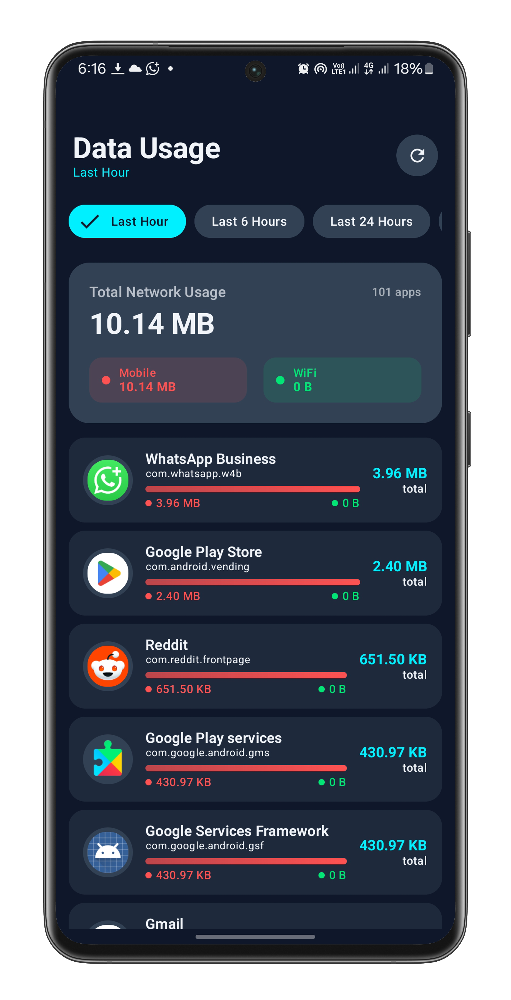

# NetStatInfo

NetStatInfo is an Android app for viewing per-app network usage on your device.

## Quick Test

Download the latest APK from
the [latest release](https://github.com/aubynsamuel/NetStatInfo/releases/latest) to try the app
quickly without building from source.

## Features

- Shows mobile, Wi-Fi, and total data usage by app.
- Supports multiple time ranges for usage filtering.
- Uses Android Usage Access permission to read local usage stats.

## Screenshots



## Requirements

- Android SDK
- JDK 11 or newer

## Build

```powershell
.\gradlew.bat assembleDebug
```

If Gradle cannot find the Android SDK, update `local.properties` with your local `sdk.dir`.
